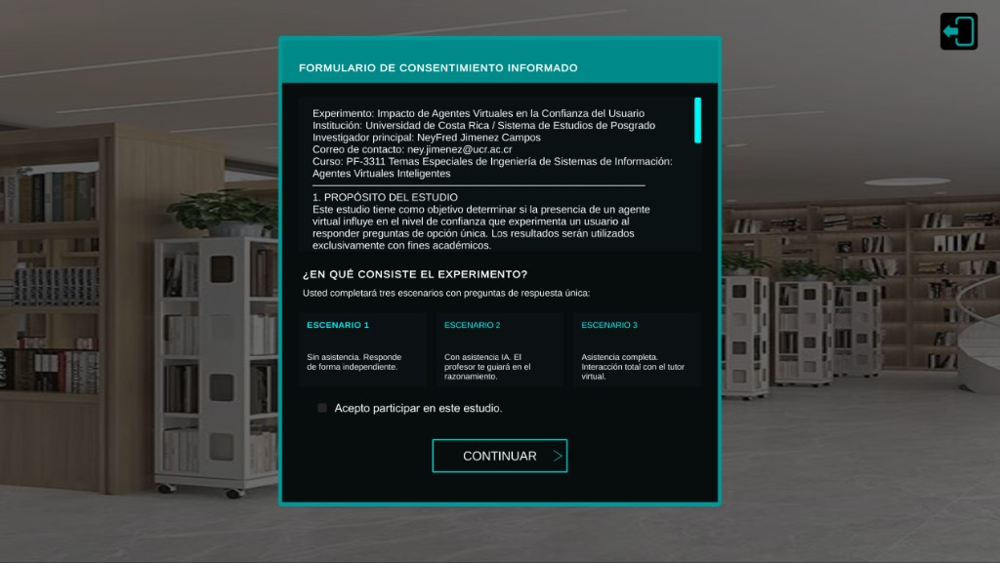
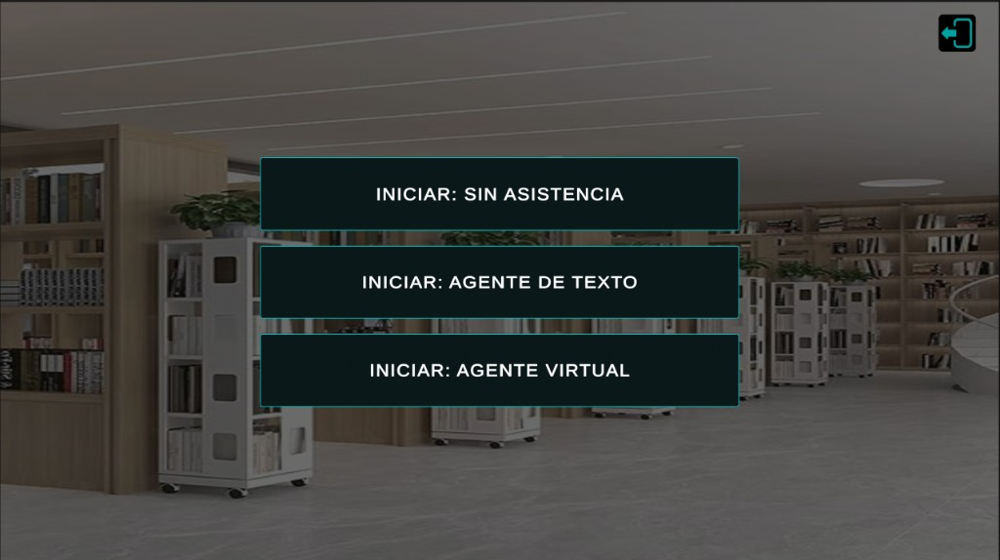
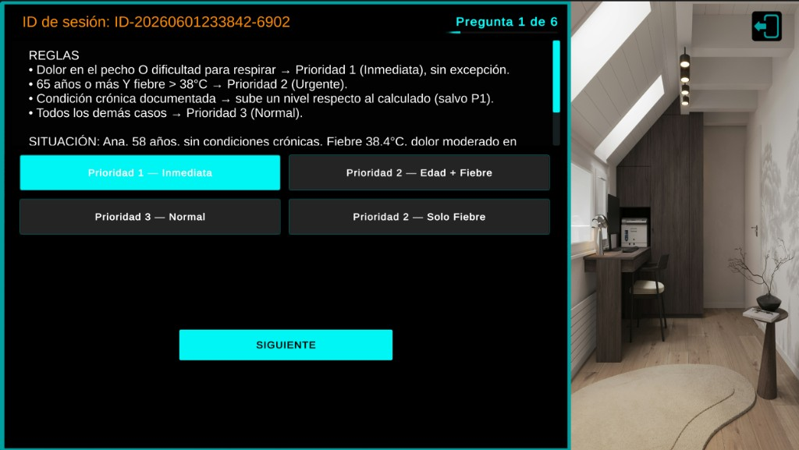
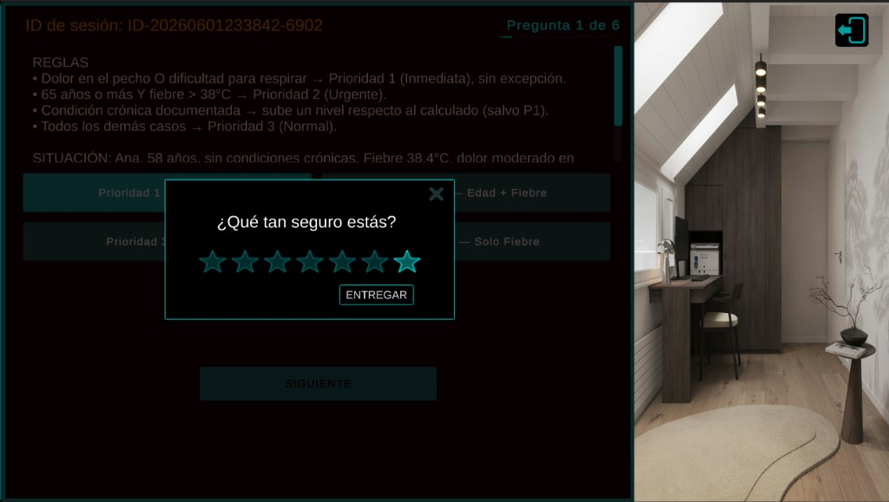
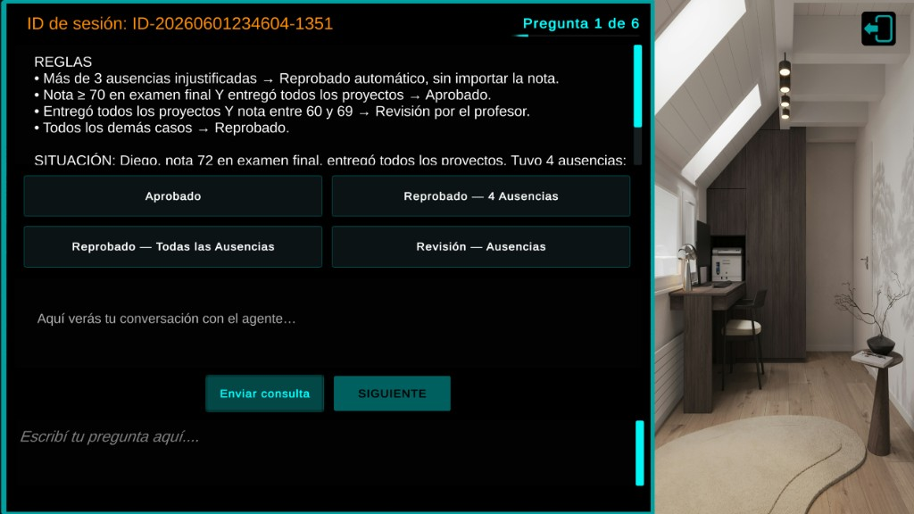
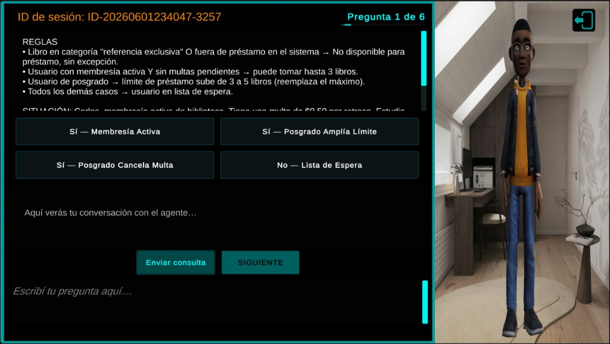
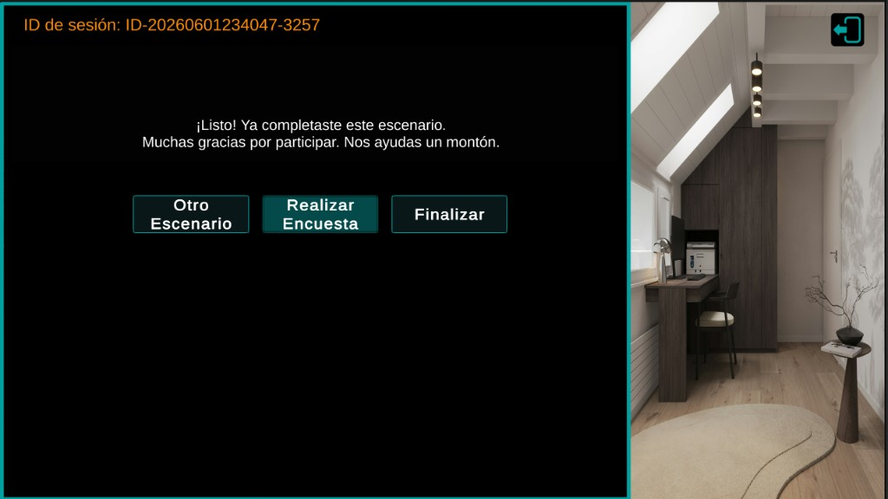

# Efecto de la visibilidad de un agente virtual en el desempeño y la confianza del usuario

**PF-3311 — Agentes Virtuales Inteligentes** · UCR, Posgrado en Computación e Informática · I Ciclo 2026  
**Investigador:** Ney Fred Jiménez Campos (B03230) · **Profesor:** Dr. Alexander Barquero Elizondo  
**Repositorio:** [github.com/jmnzcn/pf3311_proyecto](https://github.com/jmnzcn/pf3311_proyecto)

Prototipo Unity para un experimento de investigación en **español**. El participante lee escenarios con reglas, elige respuestas, califica su confianza y, según la condición, conversa con un agente (texto o avatar con voz). Cada respuesta se guarda en CSV.

**Unity:** `6000.3.11f1` · **Escena:** `Assets/Scenes/SampleScene.unity` · **Plataforma:** Windows standalone (ventana 1920×1080)

**Documentos:** [Entregable 1 (PDF)](docs/Entregable1_PF3311_NeyFredJimenez(B03230).pdf) · [Entregable 2 (Markdown)](docs/Entregable2_PF3311_NeyFredJimenez(B03230).md) · [PDF](docs/Entregable2_PF3311_NeyFredJimenez(B03230).pdf) · Regenerar figuras: `python _tools/generate_entregable_figures.py` · Regenerar Word/PDF: `python _tools/generate_entregable2_docx.py`

**Videos (YouTube, no listados):** [A](https://youtu.be/ItcvsdxPfp8) · [B](https://youtu.be/RY5pY_DVwDk) · [C](https://youtu.be/hLPTS9akSlg)

**Ejecutar sin compilar:** descomprimir `Build/Windows/` y abrir `ExperimentPrototypeB03230.exe` (ver `LEEME_PROFESOR.txt`). Ese zip incluye claves para B y C; **no subirlo al repo**.

**Estado:** [x] Entregable 1 · [x] Entregable 2 (PoC Unity) · [ ] Entregable 3 · [ ] Entregable 4

---

## Tabla de contenidos

1. [¿De qué trata?](#de-qué-trata)
2. [Condiciones experimentales](#condiciones-experimentales)
3. [Flujo del participante](#flujo-del-participante)
4. [ID de sesión y archivos de datos](#id-de-sesión-y-archivos-de-datos)
5. [Esquema del CSV (análisis)](#esquema-del-csv-análisis)
6. [Salida segura y borrado de datos](#salida-segura-y-borrado-de-datos)
7. [Estructura del proyecto](#estructura-del-proyecto)
8. [Escena y GameObjects principales](#escena-y-gameobjects-principales)
9. [Scripts (referencia detallada)](#scripts-referencia-detallada)
10. [Cableado de botones (Inspector vs runtime)](#cableado-de-botones-inspector-vs-runtime)
11. [Chat Gemini (escenarios B y C)](#chat-gemini-escenarios-b-y-c)
12. [Avatar y voz Azure (escenario C)](#avatar-y-voz-azure-escenario-c)
13. [Configuración de API keys](#configuración-de-api-keys)
14. [Cómo abrir y compilar](#cómo-abrir-y-compilar)
15. [Prueba de humo antes del piloto](#prueba-de-humo-antes-del-piloto)
16. [Regenerar preguntas desde Word](#regenerar-preguntas-desde-word)
17. [Guía para participantes (VM)](#guía-para-participantes-vm)
18. [Checklist de entrega del piloto](#checklist-de-entrega-del-piloto)
19. [Licencia y uso](#licencia-y-uso)

---

## ¿De qué trata?

Aplicación de escritorio en una **máquina virtual Windows** compartida. Cada participante se conecta a la VM y ejecuta el experimento allí (sin instalar nada en su PC):

1. **Consentimiento:** casilla y continuar.
2. **Condición:** uno de tres botones INICIAR (A, B o C).
3. **Seis preguntas:** REGLAS, SITUACIÓN, opciones A–D.
4. **Confianza:** 1–7 estrellas tras SIGUIENTE.
5. **Entregar:** guarda fila en CSV.
6. **Chat (B/C):** opcional entre preguntas; en C el avatar habla.
7. **Pantalla final:** Otro Escenario, Encuesta o Finalizar.

El mismo **ID de sesión** se mantiene si el participante elige **Otro Escenario** dentro de la misma ejecución (diseño within-subject opcional en una sola sesión).

---

## Condiciones experimentales

| Botón en UI | Condición | Índice (`OnScenarioSelected`) | Preguntas en escena | Asistencia |
|-------------|-----------|-------------------------------|---------------------|------------|
| **INICIAR: SIN ASISTENCIA** | A | `0` | 6 (bloque A) | Ninguna: sin chat ni avatar |
| **INICIAR: AGENTE DE TEXTO** | B | `1` | 6 (bloque B) | Chat Gemini; sin avatar ni voz |
| **INICIAR: AGENTE VIRTUAL** | C | `2` | 6 (bloque C) | Chat + avatar TTBoyB + TTS Azure + labios |

Las 18 preguntas están embebidas en **`SampleScene.unity` → QuestionManager → Scenarios** (3 entradas × 6 preguntas). Cada pregunta tiene:

- `situation` — texto REGLAS + SITUACIÓN + pregunta
- `optA` … `optD` — texto visible en botones
- `correctOption` — letra `A`, `B`, `C` o `D` (solo para el investigador en CSV; no se muestra al participante)

---

## Flujo del participante

```
┌─────────────────┐
│  Consentimiento │
└────────┬────────┘
         ▼
┌─────────────────┐
│ Elegir A / B / C│  ← OnScenarioSelected(0|1|2)
└────────┬────────┘
         ▼
   ┌──────────────────────────────────────┐
   │  Por cada pregunta (1 de 6):         │
   │  1. Leer escenario                   │
   │  2. Elegir A/B/C/D                   │
   │  3. SIGUIENTE → panel 7 estrellas    │
   │  4. entregar → guardar CSV           │
   │  5. (B/C) Chat opcional entre preguntas│
   └──────────────────┬───────────────────┘
                      ▼
         ┌────────────────────────┐
         │ Pantalla final         │
         │ · Otro Escenario       │
         │ · Realizar Encuesta *  │
         │ · Finalizar            │
         └────────────────────────┘
```

\* **Realizar Encuesta** visible pero **deshabilitada** hasta configurar `surveyUrl` en QuestionManager.

### Capturas de pantalla (build standalone)

| Paso | Captura |
|------|---------|
| Consentimiento |  |
| Selección A / B / C |  |
| Pregunta (condición A) |  |
| Confianza 1–7 |  |
| Agente de texto (B) |  |
| Agente virtual (C) |  |
| Fin de bloque |  |

Más figuras y diagramas en [Entregable 2 PDF](docs/Entregable2_PF3311_NeyFredJimenez(B03230)_regenerado.pdf).

### Detalles de interacción importantes

| Acción | Comportamiento |
|--------|----------------|
| **SIGUIENTE** | Abre panel de confianza; **desactiva** botones A–D hasta entregar o cerrar estrellas |
| **Cerrar panel de estrellas** | Resetea estrellas; reactiva A–D; hay que volver a SIGUIENTE para calificar |
| **entregar** | Guarda CSV; si falla el guardado, **no avanza** y muestra aviso |
| **Chat (B/C)** | Se limpia al pasar a la siguiente pregunta |
| **Chat (A)** | Panel oculto por completo |
| **Otro Escenario** | Vuelve a selección; **mismo ID de sesión** y mismo archivo CSV |
| **Finalizar** | Recarga la escena → **nuevo ID de sesión** |
| **Salida segura** | Cierra la app; puede borrar CSV (ver sección dedicada) |

---

## ID de sesión y archivos de datos

### Formato del ID

`ID-yyyyMMddHHmmss-RRRR`

- Fecha/hora local al **iniciar el primer escenario** (no al abrir la app).
- `RRRR` = 4 dígitos aleatorios (evita colisión si dos PCs arrancan en el mismo segundo).

Ejemplo: `ID-20260601193008-4821`

Se muestra en UI como **「ID de sesión: …」** en GameManager.

### Dónde se guardan los datos

| Carpeta | Archivo | Generado por | ¿Usar para análisis? |
|---------|---------|--------------|----------------------|
| **`CSV data/`** | `ExperimentData_{UserID}.csv` | `DataLogger` | **Sí — fuente principal** |
| `Logs/` | `ExperimentData_{UserID}.csv` | `ExperimentLogic.SaveDataToCSV` | No recomendado (esquema distinto, tiempos menos fiables) |

Ruta relativa al ejecutable / proyecto: `{carpeta del .exe}/CSV data/` (se crea sola).

**Reglas operativas:**

- No abrir el CSV en **Excel** mientras corre una sesión (Windows puede bloquear el archivo).
- No incluir CSVs de prueba en el zip de entrega.
- El `.gitignore` excluye `CSV data/` y `Logs/*.csv` del control de versiones.

---

## Esquema del CSV (análisis)

Encabezado (UTF-8 con BOM para Excel):

```text
UserID,ScenarioNumber,ScenarioName,QuestionNumber,AnswerLetter,Answer,CorrectAnswerLetter,CorrectAnswer,Confidence,TimeSpent(Seconds),Timestamp
```

| Columna | Descripción |
|---------|-------------|
| `UserID` | ID de sesión |
| `ScenarioNumber` | 1, 2 o 3 (A, B, C) |
| `ScenarioName` | Nombre del escenario en Inspector |
| `QuestionNumber` | 1–6 dentro del escenario |
| `AnswerLetter` | Letra elegida: `A`, `B`, `C` o `D` |
| `Answer` | Texto completo de la opción elegida |
| `CorrectAnswerLetter` | Letra correcta configurada |
| `CorrectAnswer` | Texto de la opción correcta |
| `Confidence` | 1–7 (estrellas) |
| `TimeSpent(Seconds)` | Segundos desde mostrar la pregunta hasta entregar (Q1: desde inicio del escenario) |
| `Timestamp` | `yyyy-MM-dd HH:mm:ss` local |

**Ejemplo de fila:**

```text
ID-20260601193008-4821,1,Condición A — Sin Asistencia,1,B,Prioridad 2 (Urgente),B,Prioridad 2 (Urgente),5,42.30,2026-06-01 19:31:02
```

**Cálculo de aciertos:** `AnswerLetter == CorrectAnswerLetter`

**Nota:** Las interacciones con el chat **no** se registran en CSV (solo respuesta final + confianza).

---

## Salida segura y borrado de datos

El participante puede salir confirmando en el popup de salida segura (`QuestionManager.SafeExit`).

| Situación | ¿Se borra `CSV data/ExperimentData_*.csv`? |
|-----------|---------------------------------------------|
| Sale a mitad del **primer** escenario sin completarlo | **Sí** |
| Sale en la **última pregunta** sin entregar (primer escenario) | **Sí** |
| **Completó** un escenario (pantalla final) y sale | **No** |
| Tras **Otro Escenario**, en pantalla de selección, y sale | **No** |
| Completó escenario A, empezó B a medias, y sale | **No** (conserva filas de A; filas parciales de B quedan para filtrar) |

Solo se borra el archivo en **`CSV data/`**. El CSV en `Logs/` (secundario) **no** se elimina automáticamente.

---

## Estructura del proyecto

```
ExperimentPrototypeB03230/
├── Assets/
│   ├── _Project/
│   │   ├── Scripts/
│   │   │   ├── Core/
│   │   │   │   ├── ExperimentLogic.cs       # Consentimiento, sesión, chat Gemini
│   │   │   │   ├── QuestionManager.cs       # Flujo UI, escenarios, confianza
│   │   │   │   ├── DataLogger.cs            # CSV primario
│   │   │   │   └── AvatarDisplayController.cs
│   │   │   └── Audio/
│   │   │       ├── AzureLipSync.cs          # TTS + visemas Azure
│   │   │       └── AgentSpeechController.cs # Delega voz a AzureLipSync
│   │   └── Art/UI/                          # Sprites UI (estrellas, fondos, etc.)
│   ├── Scenes/
│   │   └── SampleScene.unity                # Escena única del build
│   ├── 1toonteen/                           # Prefab TTBoyB, animaciones, texturas
│   ├── Packages/                            # NuGet (Azure Speech SDK)
│   ├── Settings/                            # Perfiles URP
│   └── TextMesh Pro/
├── _tools/
│   └── generate_scenarios_yaml.py           # Actualizar preguntas desde .docx
├── GUIA_PARTICIPANTE.md                     # Instrucciones para participantes en la VM
├── README.md                                # Documentación técnica completa
├── CSV data/                                # Datos participantes (generado al correr)
├── Logs/                                    # CSV secundario + logs Unity
├── ProjectSettings/
└── Packages/                                # manifest Unity (URP, ugui, etc.)
```

---

## Escena y GameObjects principales

| GameObject | Script(s) | Rol |
|------------|-----------|-----|
| **GameManager** | `ExperimentLogic`, `AgentSpeechController` | Consentimiento, ID sesión, chat, API Gemini |
| **QuestionManager** | `QuestionManager`, `AvatarDisplayController` | Preguntas, confianza, progreso, avatar en panel |
| **DataLogger** | `DataLogger` | Escritura CSV primario |
| **TTBoyB** | `AzureLipSync`, `AudioSource` | Avatar 3D; inactivo hasta escenario C |
| **Main Camera** | — | Referenciada por `AvatarDisplayController` |
| **RightPanel** | — | Panel UI donde se renderiza el avatar (RenderTexture) |

Referencias críticas en Inspector (no usar `GameObject.Find`):

- QuestionManager → `characterModel` → TTBoyB
- AvatarDisplayController → `displayPanel` → RightPanel, `mainCamera` → Main Camera

---

## Scripts (referencia detallada)

### `ExperimentLogic` (GameManager)

**Responsabilidad:** consentimiento, ID de sesión, integración con Gemini, avisos de error de red/guardado.

| Función / área | Detalle |
|----------------|---------|
| Consentimiento | Toggle + botón continuar; sin consentimiento no inicia escenario |
| `OnScenarioSelected(int)` | Debe recibir **0, 1 o 2** en cada botón INICIAR (no existe overload sin parámetro) |
| `EnsureSessionUserId()` | Crea ID al primer escenario; persiste con Otro Escenario |
| Chat Gemini | Modelo `gemini-2.5-flash`; prompt prohíbe dar la respuesta correcta |
| `geminiInFlight` | Bloquea envíos duplicados; deshabilita input durante la petición |
| Mensajes pendientes | El texto del estudiante solo se confirma en UI/historial si la API responde OK |
| `NotifyDataSaveFailure()` | Escenario A: aviso en área de pregunta; B/C: aviso en chat |
| `SaveDataToCSV` | Export **secundario** a `Logs/` (opcional para análisis) |
| `FinalizeAndResetSession()` | Recarga escena → nueva sesión |

**No gestiona:** contador de preguntas, barra de progreso ni texto del enunciado (eso es `QuestionManager`).

---

### `QuestionManager` (namespace `MyProject`)

**Responsabilidad:** flujo completo de preguntas, UI, confianza, guardado, pantallas finales.

| Función / área | Detalle |
|----------------|---------|
| `scenarios` | Lista de 3 escenarios con 6 preguntas cada uno |
| `BeginScenario(index)` | Carga preguntas; activa avatar solo en índice 2; resetea timer CSV |
| `IsChatAssistanceEnabled` | `true` solo en escenarios B y C (índice ≥ 1) |
| Opciones A–D | Cableadas en **runtime** en `Start()` |
| Confianza | 7 estrellas; A–D bloqueados mientras panel abierto |
| `OnEntregarClicked` | Llama `DataLogger.SaveAnswer`; no avanza si falla |
| `SafeExit` | Borra CSV según reglas de sesión |
| `surveyUrl` / `OpenSurvey` | Abre URL externa si está configurada |
| `ResetToScenarioSelection` | Otro Escenario → vuelve a selección sin nuevo ID |

---

### `DataLogger`

**Responsabilidad:** única fuente oficial de datos en `CSV data/`.

- Escritura con **lock** y **reintentos** (5 intentos, backoff ante `IOException`).
- UTF-8 **con BOM** al crear archivo nuevo.
- `ResetQuestionTimer()` al iniciar escenario (TimeSpent de Q1 no incluye consentimiento).
- `DeleteIncompleteFile()` usado por salida segura.

---

### `AvatarDisplayController`

**Responsabilidad:** mostrar TTBoyB en el panel derecho solo en escenario C.

- Crea RenderTexture + cámara dedicada (capa `Avatar`, índice 6).
- Oculta avatar de la cámara principal mientras se muestra.
- Referencias serializadas: `characterModel`, `displayPanel`, `mainCamera`.

---

### `AzureLipSync` + `AgentSpeechController`

**Responsabilidad:** voz del profesor en escenario C.

| Componente | Detalle |
|------------|---------|
| `AgentSpeechController` | Punto de entrada; llama `AzureLipSync.SpeakText` |
| Azure TTS | Voz `es-MX-JorgeNeural` (configurable); región típica `eastus` |
| Visemas | Mueven blend shapes y animador (`TTB_talk2` / `TTB_idle1`) |
| Foco ventana | Pausa/reanuda audio si la ventana pierde foco |
| Activación | Solo cuando TTBoyB está activo y visible |

El lip sync usa **visemas de Azure**, no uLipSync (paquete eliminado del proyecto).

La síntesis de voz y el mapeo de visemas en `AzureLipSync.cs` se basaron en la documentación y ejemplos del [Microsoft Azure Cognitive Services Speech SDK](https://github.com/Azure-Samples/cognitive-services-speech-sdk).

---

## Cableado de botones (Inspector vs runtime)

### Cableados en Inspector (`SampleScene`)

| Botón / evento | Método | Parámetro |
|----------------|--------|-----------|
| INICIAR sin asistencia | `ExperimentLogic.OnScenarioSelected` | `0` |
| INICIAR agente texto | `ExperimentLogic.OnScenarioSelected` | `1` |
| INICIAR agente virtual | `ExperimentLogic.OnScenarioSelected` | `2` |
| Estrellas 1–7 | `QuestionManager.OnStarClicked` | `1` … `7` |
| Enviar chat | `ExperimentLogic.AskForHelp` | — |
| Otro Escenario | `ExperimentLogic.ResetToScenarioSelection` | — |
| Finalizar | `ExperimentLogic.FinalizeAndResetSession` | — |
| Salida segura (confirmar) | `QuestionManager.SafeExit` | — |
| Cerrar panel estrellas | `QuestionManager.CloseConfidencePopup` | — |

### Cableados en runtime (`QuestionManager.Start`)

Vacíos en Inspector a propósito:

- Botones **A, B, C, D** → `OnOptionSelected("A"|"B"|…, texto)`
- **SIGUIENTE** → `OnSiguienteClicked`
- **entregar** → `OnEntregarClicked`
- **Realizar Encuesta** → `OpenSurvey`

**Importante:** en Unity Event, `QuestionManager` aparece como **`MyProject.QuestionManager`**.

---

## Chat Gemini (escenarios B y C)

1. El participante escribe y pulsa Enviar.
2. Mientras espera, ve su mensaje como *Enviando…* (aún no entra al historial permanente).
3. Si la API responde: se guarda turno usuario + respuesta profesor; en C también dispara TTS.
4. Si falla (red, 429, respuesta vacía): aviso amarillo en chat; **no** se añade el mensaje al contexto API (puede reintentar).
5. Al pasar a la **siguiente pregunta**, el chat se reinicia (placeholder en español).

**Instrucciones al modelo (resumen):** actuar como profesor empático; **nunca** dar la opción correcta; guiar con preguntas; respuestas breves (2–3 oraciones); sin saludos salvo que el estudiante salude primero.

---

## Avatar y voz Azure (escenario C)

1. Al elegir **AGENTE VIRTUAL**, se activa TTBoyB y el panel derecho muestra el render del avatar.
2. Cada respuesta del chat en texto también se envía a Azure TTS.
3. `AgentSpeechController.Speak` → `AzureLipSync.SpeakText` → audio + animación de boca.
4. Al terminar el escenario o cambiar condición, el avatar se oculta.

**Configuración:** TTBoyB → `AzureLipSync` → `subscriptionKey`, `region`, refs a mesh, animador y `AudioSource`.

---

## Configuración de API keys

Configurar en **Inspector** de la máquina del piloto. **No** commitear claves reales.

| Servicio | GameObject | Componente | Campo |
|----------|------------|------------|-------|
| Gemini | GameManager | `ExperimentLogic` | `apiKey` |
| Azure Speech | TTBoyB | `AzureLipSync` | `subscriptionKey`, `region` |

Antes de entregar el zip del proyecto:

1. **Rotar** claves usadas en desarrollo.
2. **Vaciar** campos en escena y default en `ExperimentLogic.cs`.
3. Documentar que las claves válidas se configuran en el build instalado en la **máquina virtual** (sin subirlas al repositorio).

**Encuesta:** QuestionManager → `Survey Url` → URL completa (`https://…`). Vacío = botón visible pero no clicable.

---

## Cómo abrir y compilar

### Abrir en Unity

1. Unity Hub → **6000.3.11f1**.
2. **Add project from disk** → esta carpeta.
3. Abrir `Assets/Scenes/SampleScene.unity`.
4. Configurar API keys.
5. **Play** para probar en Editor.

### Build standalone (piloto)

**Project Settings → Player:**

| Setting | Valor |
|---------|-------|
| Fullscreen Mode | Windowed |
| Default resolution | 1920 × 1080 |
| Run In Background | On |
| Force Single Instance | **On** (evita dos .exe escribiendo el mismo CSV) |

**Opción A (Editor abierto):** File > Build Profiles > Build. Salida: `Build/Windows/`.

**Opción B (Editor cerrado):**
Cierra Unity por completo (no puede haber dos instancias en el mismo proyecto). Luego:

```bat
_tools\build_windows.bat
```

Equivalente manual:

```bat
"C:\Program Files\Unity\Hub\Editor\6000.3.11f1\Editor\Unity.exe" -batchmode -nographics -quit ^
  -projectPath "RUTA_AL_PROYECTO" ^
  -executeMethod StandaloneBuild.PerformWindowsBuild ^
  -logFile "Logs\standalone-build.log"
```

Resultado: `Build/Windows/ExperimentPrototypeB03230.exe` (+ carpeta `_Data` y DLLs). Log en `Logs/standalone-build.log`.

**Tiempo orientativo (PC similar al tuyo, Library ya generada):**

| Método | Primera vez | Rebuild tras cambio menor |
|--------|-------------|---------------------------|
| Build Profiles (Editor abierto) | 8–15 min | 3–8 min |
| Batch (`build_windows.bat`) | 10–20 min | 5–12 min |

El build incluye avatar, URP y Azure Speech; el `.exe` completo suele pesar **~150–350 MB**. Para GitHub, subí un **Release** con zip de `Build/Windows/` (la carpeta `Build/` está en `.gitignore`).

**Build con claves para el evaluador:** el zip de `Build/Windows/` generado para entrega puede incluir Gemini y Azure ya configurados (sin subir esas claves al código fuente del repo). Incluye `LEEME_PROFESOR.txt` en el zip. Antes de `git push`, la escena del proyecto debe quedar con placeholders (`YOUR_*`); el repositorio no debe contener claves reales (requisito del curso).

Tras **cualquier** cambio de scripts o settings, generar un **build nuevo**; un `.exe` antiguo no incluye los fixes.

### Qué incluir / excluir en el zip

| Incluir | Excluir |
|---------|---------|
| `Assets/`, `Packages/`, `ProjectSettings/`, `README.md`, `GUIA_PARTICIPANTE.md`, `_tools/` | `Library/`, `Logs/`, `UserSettings/`, `Temp/` |
| | `CSV data/*.csv`, claves en texto plano |

---

## Prueba de humo antes del piloto

Ejecutar en **build standalone** en la VM (o en un PC con la misma resolución 1920×1080) (~20 min).

### Flujo básico

1. **Consentimiento** → continuar → elegir escenario.
2. **Escenario A:** una pregunta completa (opción, SIGUIENTE, estrellas, entregar).
3. Abrir `CSV data/ExperimentData_*.csv` y verificar columnas `AnswerLetter`, `Answer`, `CorrectAnswerLetter`, `Confidence`, `TimeSpent`.
4. **Escenario B:** mensaje al chat; respuesta en español; sin Wi‑Fi muestra aviso.
5. **Escenario C:** avatar visible; chat con texto, voz y labios.

### Casos de borde

6. **Fallo de guardado (A):** con sesión en curso, abrir el CSV en Excel → entregar → debe aparecer aviso en área de pregunta y **no** avanzar. Cerrar Excel → entregar de nuevo → OK.
7. **Salida segura (primer escenario incompleto):** iniciar A, responder 1–2 preguntas, salir confirmando → CSV debe **eliminarse**.
8. **Otro Escenario:** completar A → Otro Escenario → salir desde selección → CSV debe **conservarse**.
9. **Segundo escenario parcial:** completar A → iniciar B → salir a mitad → CSV conserva filas de A.
10. **Confianza:** con panel de estrellas abierto, A–D no deben ser clicables.
11. **Pantalla final:** tres botones; encuesta deshabilitada si no hay URL.

---

## Regenerar preguntas desde Word

Si actualizan el documento oficial de preguntas:

1. Editar `DOCX` al inicio de `_tools/generate_scenarios_yaml.py`.
2. Ejecutar (Python 3) desde la raíz del proyecto:
   ```bash
   python _tools/generate_scenarios_yaml.py
   ```
3. Abrir Unity → verificar **QuestionManager → Scenarios** en la escena.
4. Probar al menos una pregunta por condición A/B/C.

El script parchea el bloque `scenarios:` en `SampleScene.unity` (espera 6 preguntas por escenario).

---

## Guía para participantes (VM)

Documento para quien accede a la máquina virtual: **[GUIA_PARTICIPANTE.md](GUIA_PARTICIPANTE.md)**.

| Tarea | Qué hacer |
|-------|-----------|
| Acceso | Conectar a la VM con credenciales del investigador; abrir el `.exe` en la VM |
| Iniciar sesión | Aceptar consentimiento y elegir condición según orden asignado |
| Ver ID | Aparece en pantalla al iniciar escenario; anotarlo si el investigador lo pidió |
| Durante sesión | **No** abrir CSVs en Excel en la VM |
| Sin internet en VM | Escenario A funciona; B/C muestran aviso en chat |
| Tras sesión | Datos en `CSV data/` **en la VM**; avisar al investigador; cerrar conexión |
| Log de errores | En la VM: `%LOCALAPPDATA%\LocalLow\DefaultCompany\ExperimentPrototypeB03230\Player.log` |
| Tres condiciones | **Otro Escenario** entre bloques; **Finalizar** solo al terminar todo |

### Despliegue en máquina virtual (investigador)

1. Instalar el build standalone en la VM (1920×1080, API keys configuradas).
2. Enviar a cada participante: credenciales de acceso a la VM, [GUIA_PARTICIPANTE.md](GUIA_PARTICIPANTE.md) y orden de condiciones (A/B/C).
3. Tras cada sesión, recoger CSV desde `CSV data/` en la VM (o carpeta compartida del servidor).
4. Opcional: limpiar CSVs de prueba o preparar VM para el siguiente participante.
5. Enviar enlace meCUE post-sesión si no está en `surveyUrl` del build.

---

## Limpieza antes de GitHub o entrega

Desde la raíz del proyecto:

```powershell
python _tools/clean_for_delivery.py
```

El script borra CSVs de prueba en `Logs/` y `CSV data/`, elimina `obj/` y `Temp/`, y deja placeholders en las claves de `ExperimentLogic.cs` y `SampleScene.unity`. Simulación sin cambios: `python _tools/clean_for_delivery.py --dry-run`.

**No incluir en el repositorio** (ya están en `.gitignore`): `Library/`, `Logs/`, `UserSettings/`, `obj/`, `Temp/`, `CSV data/`.

**Zip mínimo reproducible** (sin reimportar todo): `Assets/`, `Packages/`, `ProjectSettings/`, `docs/`, `README.md`, `GUIA_PARTICIPANTE.md`, `_tools/`, `.gitignore`. Quien clone abrirá el proyecto en Unity 6000.3.11f1 y reimportará `Library/` localmente.

**Opcional** (borra caché de Unity; la próxima apertura tarda más): `python _tools/clean_for_delivery.py --include-unity-cache`

**Quitar rastro de proyectos viejos** (p. ej. `ExperimentPrototype V14` en layouts del editor): no incluir `UserSettings/` en el zip, o borrarlo con `python _tools/clean_for_delivery.py --remove-user-settings` (Unity recrea el layout por defecto al abrir).

Después de limpiar, **rotar** las claves Gemini y Azure en sus consolas (ya se usaron en pruebas) y configurarlas solo en la VM del piloto, en el Inspector.

---

## Checklist de entrega del piloto

- [ ] Rotar claves Gemini y Azure usadas en desarrollo.
- [ ] Vaciar claves en código fuente y en `SampleScene.unity`.
- [ ] Configurar claves válidas en el build instalado en la VM.
- [ ] Borrar `CSV data/*.csv` y `Logs/ExperimentData_*.csv` de prueba en la VM.
- [ ] **Force Single Instance** activo; rebuild standalone 1920×1080.
- [ ] Smoke test completo en la VM (~20 min).
- [ ] Repo sin `Library/`, sin CSVs de participantes, sin claves en GitHub.
- [ ] Incluir `GUIA_PARTICIPANTE.md` en materiales enviados junto con acceso a la VM.
- [ ] Instrucción a participantes: no abrir CSVs en la VM; avisar al investigador al terminar.
- [ ] (Opcional) Pegar `surveyUrl` si hay encuesta post-estudio.
- [ ] (Opcional) Cambiar `companyName` en Player Settings para localizar `Player.log`.

---

## Licencia y uso

Prototipo de investigación. Usar según consentimiento del estudio.

- No publicar datos de participantes ni claves API en GitHub.
- Guía para participantes: [GUIA_PARTICIPANTE.md](GUIA_PARTICIPANTE.md).
- Azure Speech SDK (ejemplos de TTS/visemas) y avatar TTBoyB (`Assets/1toonteen/`).

---

## Nota sobre herramientas de IA

ChatGPT y Claude se usaron puntualmente para ordenar texto y revisar redacción. El contenido y las decisiones del proyecto son del autor.
