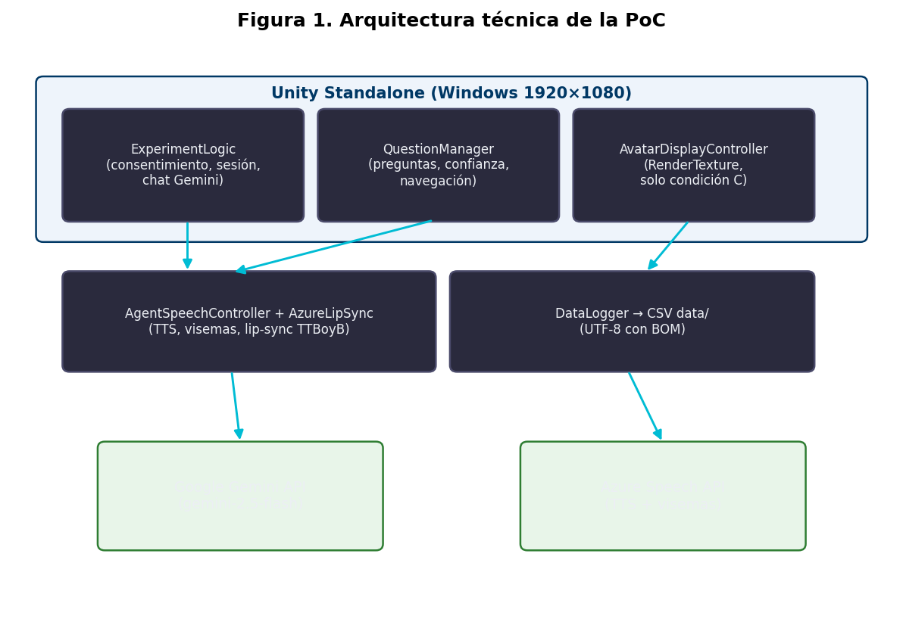
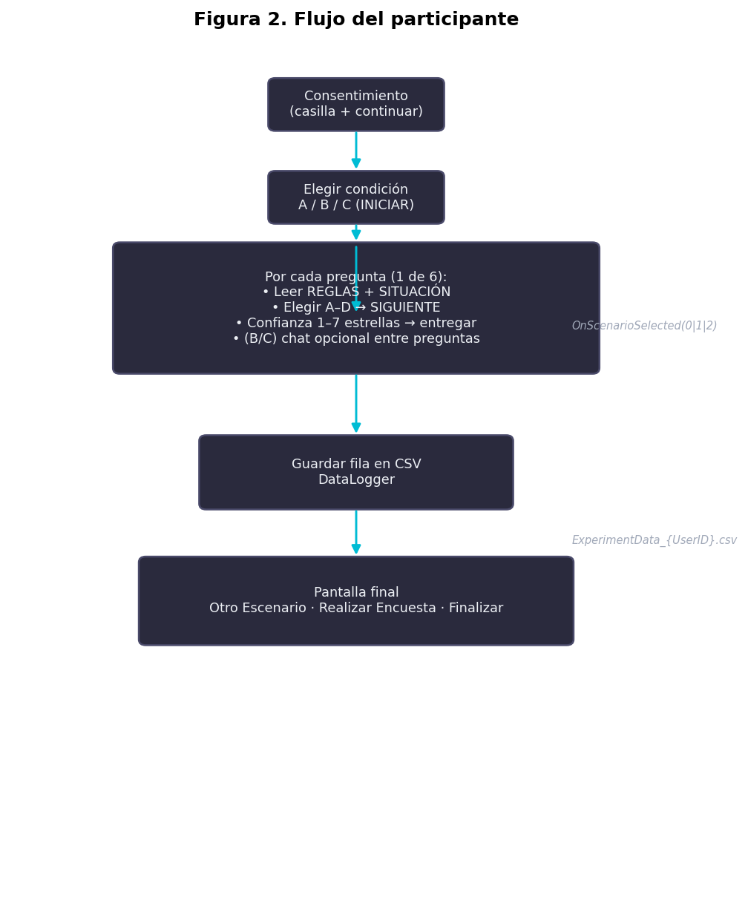

# PF-3311: Agentes Virtuales Inteligentes

## ENTREGABLE 2
### Avance de Agente e Investigación

**Título de la investigación:**  
Efecto de la visibilidad de un agente virtual en el desempeño y la confianza del usuario en tareas de decisión basadas en reglas

**Profesor:** Dr. Alexander Barquero  
**Investigador principal:** Ney Fred Jiménez Campos (B03230)  
**Fecha:** 1 de junio de 2026  
**I Ciclo, 2026**

**Repositorio GitHub:** https://github.com/jmnzcn/pf3311_proyecto (código fuente sin claves API).

**Videos de demostración (YouTube, no listados):**

| Escenario | Condición | Enlace |
|-----------|-----------|--------|
| 1 | A, sin agente | https://youtu.be/ItcvsdxPfp8 |
| 2 | B, agente de texto | https://youtu.be/RY5pY_DVwDk |
| 3 | C, agente virtual + voz | https://youtu.be/hLPTS9akSlg |

---

## Resumen

Este entregable documenta el avance del Entregable 1 hacia una prueba de concepto (PoC) en Unity y el diseño del piloto. La aplicación integra interfaz del experimento, LLM (Gemini), voz con avatar 3D (Azure) y registro en CSV. El participante usa un build standalone en una máquina virtual Windows; no instala software en su PC.

Las tres condiciones (sin agente, agente solo texto, agente con avatar) están implementadas. El agente aclara reglas pero no entrega la respuesta correcta (system prompt restrictivo).

El piloto será within-subjects (N = 10–12) con **adultos mayores de 18 años**. No se exige ser estudiante de la UCR ni pertenecer a una profesión concreta. Es un piloto exploratorio alineado a RQ1–RQ3 y al enunciado del curso (sin usuarios clínicos que requieran CEC). La revisión del protocolo por expertos (docente o pares del curso) es independiente de la muestra de participantes.

---

## Tabla de contenidos

1. [Resumen de cambios desde el Entregable 1](#a-resumen-de-cambios-desde-el-entregable-1)
2. [Estado actual del agente](#b-estado-actual-del-agente)
3. [Diseño metodológico del estudio](#c-diseño-metodológico-del-estudio)
4. [Métricas](#d-métricas)
5. [Instrumentos de recolección de datos](#e-instrumentos-de-recolección-de-datos)
6. [Protocolos de interacción](#f-protocolos-de-interacción)
7. [Limitaciones y riesgos](#g-limitaciones-y-riesgos)
8. [Referencias](#referencias)

---

## a) Resumen de cambios desde el Entregable 1

### Retroalimentación recibida

En el repositorio no hay retroalimentación escrita del profesor tras el Entregable 1. Los cambios respondieron a la propuesta original, al enunciado del Entregable 2 y a pruebas del prototipo (ID de sesión, CSV, chat oculto en A, salida segura, documentación).

### Cambios respecto al Entregable 1

| Aspecto | Entregable 1 | Entregable 2 (actual) | Motivo |
|---------|--------------|----------------------|--------|
| Problema y RQs | RQ1 precisión; RQ2 confianza; RQ3 calibración | Igual en lo esencial | El piloto sigue respondiendo las mismas preguntas |
| Condiciones A/B/C | Sin agente / texto / avatar | Tres botones INICIAR | Mismo LLM en B y C; cambia solo lo visual |
| LLM | GPT-4o mini (alt. Claude Haiku) | Gemini 2.5 Flash | Créditos disponibles, buen español, latencia ≤ 3 s en pruebas |
| Backend | FastAPI | Orquestación en Unity | Menos piezas; un solo `.exe` |
| TTS + lip-sync | ElevenLabs / Google Cloud TTS | Azure Speech + visemas | Visemas nativos para los blend shapes del avatar |
| Avatar | Modelo Turbosquid genérico | TTBoyB (`1toonteen/`) | Asset con rig y animaciones ya integrado |
| Unity | 2022.3 LTS | 6000.3.11f1 | Versión del entorno de desarrollo |
| Despliegue | VM remota | VM Windows con build 1920×1080 | El participante entra por RDP; el CSV queda en el servidor |
| Ítems | 6–8 casos | 6 por condición (18 total) | Misma lógica de reglas en los tres bloques |
| Confianza | Escala 1–7 por pregunta | 7 estrellas en pantalla | Captura inmediata, no retrospectiva |
| meCUE 2.0 | Google Forms tras cada bloque (B/C) + RAW-TLX en A/B/C | `docs/Cuestionario_meCUE_…docx` → 4 Forms | Alineado con Tarea 10 (matriz) y protocolo |
| Datos | CSV en backend | CSV en `CSV data/` | Una sola fuente para análisis |
| Seguridad | Variables de entorno | `.gitignore`; claves solo en build/Release, no en GitHub | Requisito del curso |

### Elementos del E1 no incorporados

| Elemento E1 | Decisión E2 | Justificación |
|-------------|-------------|---------------|
| Backend FastAPI | No implementado | La PoC demuestra que los componentes se comunican; Unity llama las APIs directamente. Un backend se reconsiderará si hace falta centralizar logs |
| VM remota | PoC en VM del investigador | Build en la VM; participantes por escritorio remoto |
| Tarea de práctica sin registro | **Implementado** | Botón INICIAR: PRÁCTICA; ítem dummy; sin filas CSV; ver `GUIA_PARTICIPANTE.md` |
| Registro de turnos de chat en CSV | **Implementado** | `ChatLog_*`, scoring heurístico, resúmenes y eventos API |
| GPT-4o mini | Sustituido por Gemini | Ya estaba previsto en E1 según créditos; no altera el diseño |

### Lo que se mantiene del Entregable 1

- Diseño within-subjects: cada participante pasa por A, B y C.
- System prompt restrictivo.
- Misma asistencia del LLM en B (texto) y C (texto + voz + avatar).
- Precisión objetiva y confianza subjetiva en paralelo.
- meCUE 2.0 modular tras cada bloque B y C; RAW-TLX tras A, B y C (ver `docs/Cuestionario_meCUE_PF3311_NeyFredJimenez_B03230.docx`).
- Tono del agente: neutro, profesional, conciso; español costarricense (*vos*).

---

## b) Estado actual del agente

### Descripción del prototipo

Se trata de una aplicación standalone Windows (Unity 6000.3.11f1, URP, 1920×1080). Flujo:

1. Consentimiento informado (código participante + dos casillas).
2. Selección: práctica opcional + condiciones A, B, C (orden mostrado en pantalla según código).
3. Seis preguntas con REGLAS + SITUACIÓN y opciones A–D.
4. Confianza del 1 al 7 después de cada respuesta.
5. Chat con el agente en B y C (opcional entre preguntas).
6. Pantalla final: Otro Escenario (mismo ID de sesión), Encuesta o Finalizar.

Cada respuesta se guarda en `CSV data/ExperimentData_{ParticipantCode}_{SessionID}.csv`.

### Integración de componentes

En el build standalone se comprobó este flujo entre módulos:

```
Participante escribe en chat (B o C)
        |
        v
ExperimentLogic.AskForHelp()
        |  incluye el escenario en el system prompt
        v
API Gemini 2.5 Flash  ->  respuesta en el panel de chat
        |
        v (solo condición C)
AgentSpeechController.Speak()
        |
        v
AzureLipSync.SpeakText()  ->  audio TTS + visemas -> blend shapes TTBoyB
        |
        v
Participante elige A-D, confianza, entregar
        |
        v
DataLogger.SaveAnswer()  ->  CSV data/ (UTF-8 con BOM)
        |
        + (B/C) ChatSessionLogger  ->  ChatLog_*, ChatHelpRating_*, resúmenes
        + (C) TtsLog_* via AzureLipSync
        + (B/C) ChatApiEvent_* si falla Gemini
```

**De la arquitectura E1 a lo implementado**

| Subsistema E1 | Componente E2 | Estado |
|---------------|---------------|--------|
| Frontend / UI | `ExperimentLogic`, `QuestionManager`, UI en `SampleScene` | Implementado |
| LLM | Gemini API desde `ExperimentLogic` | Implementado |
| TTS + avatar | `AzureLipSync`, `AgentSpeechController`, `AvatarDisplayController`, TTBoyB | Implementado (solo C) |
| Registro de datos | `DataLogger` -> `CSV data/` | Implementado |
| Backend FastAPI | (no aplica) | Reemplazado por orquestación en Unity |

### Arquitectura técnica





### Comportamiento del agente

El system prompt en `ExperimentLogic.BuildSystemPreamble()` instruye al modelo para que:

- Actúe como profesor empático en un chat.
- No entregue nunca la respuesta final ni la opción correcta, aunque se lo pidan.
- Guíe con preguntas y pistas cortas (máximo 2–3 oraciones).
- Omita saludos si el estudiante no saludó primero.
- Utilice el texto del escenario actual como contexto en cada turno.

En condición C, el texto del chat pasa a Azure TTS; el avatar anima labios con visemas.

La síntesis de voz y el mapeo de visemas siguen la documentación del [Azure Cognitive Services Speech SDK](https://github.com/Azure-Samples/cognitive-services-speech-sdk). El avatar 3D TTBoyB proviene del asset `1toonteen/` (`Assets/1toonteen/`).

### Capturas de pantalla (Figuras 3–8)

Capturas del build standalone (1920×1080).


### Funcionalidades implementadas y pendientes

| Funcionalidad | Estado | Notas |
|---------------|--------|-------|
| Consentimiento obligatorio | Implementado | `ExperimentLogic` |
| Condiciones A / B / C | Implementado | Índices 0, 1, 2 |
| 6 preguntas x 3 bloques (18 ítems) | Implementado | `QuestionManager.scenarios` |
| Confianza 1–7 por ítem | Implementado | Panel de estrellas |
| Chat Gemini (B/C); oculto en A | Implementado | Prompt restrictivo |
| Avatar 3D + TTS + lip-sync (C) | Implementado | Azure + TTBoyB |
| CSV primario para análisis | Implementado | `DataLogger` |
| ID de sesión único (`ID-yyyyMMddHHmmss-RRRR`) | Implementado | Persiste con Otro Escenario |
| Salida segura con borrado condicional | Implementado | `SafeExit` |
| Aviso si falla guardado CSV | Implementado | Respuestas (A) y chat/TTS (B/C) |
| Force Single Instance | Implementado | Project Settings |
| README + GUIA_PARTICIPANTE.md | Implementado | Acceso vía máquina virtual |
| Build Windows listo para evaluar | Implementado | `Build/Windows/` (~141 MB); ver `LEEME_PROFESOR.txt` |
| Encuesta meCUE (`surveyUrl` / Forms externos) | Plantilla en `docs/Cuestionario_meCUE_…docx`; crear 4 Google Forms | Pendiente URLs en Forms |
| Código participante (P + número, ej. P01, P20) | Implementado | Consentimiento + CSV; normalización automática |
| Clave correcta en CSV | Implementado | `CorrectAnswerLetter` |
| Tarea de práctica sin registro | **Implementado** | `PracticeScenarioContent`, botón en selección; agente según primer bloque del orden |
| Bloques completados bloqueados en UI | **Implementado** | Subtexto COMPLETADO; `MarkConditionCompleted` |
| Orden de condiciones en pantalla | **Implementado** | `ParticipantConditionOrder`; slot `(n−1) % 6` |
| Log de turnos de chat en CSV | **Implementado** | Turnos crudos, scoring, resúmenes por pregunta/escenario, TTS (C) y fallos API |
| Análisis latencia Gemini / TTS | **Implementado** | `_tools/summarize_gemini_latency.py`, `_tools/summarize_tts_success.py` |
| Pipeline RQ1–RQ3 (tablas, gráficos, inferencia) | **Implementado** | `_tools/analyze_all_rq.py` → `_analysis/` (solo cálculos; informe y `docs/` aparte) |
| Validación formal de dificultad de ítems | Pendiente | Revisión en el piloto |
| Contrabalanceo automático de orden | Parcial | Orden calculado y mostrado en app; investigador verifica secuencia |

### Reproducibilidad

**Opción 1 (recomendada para el evaluador):** descomprimir `Build/Windows/` y ejecutar `ExperimentPrototypeB03230.exe`. Incluye claves API para condiciones B y C. Instrucciones en `Build/Windows/LEEME_PROFESOR.txt`.

**Opción 2 (código fuente):** ver README.md. Pasos básicos:

1. Unity Hub 6000.3.11f1, escena `SampleScene.unity`.
2. Configurar `apiKey` (Gemini) y `subscriptionKey`/`region` (Azure) en el Inspector.
3. Build: File > Build Profiles, o `_tools\build_windows.bat` con el Editor cerrado.
4. Datos en `{carpeta del .exe}/CSV data/`.

Participantes en la VM: [GUIA_PARTICIPANTE.md](../GUIA_PARTICIPANTE.md).

El repositorio GitHub lleva el código y `docs/` con este informe en PDF. El zip del build puede adjuntarse como Release (no incluir claves en el repo).

## c) Diseño metodológico del estudio

### Preguntas de investigación

**RQ1 (Precisión):** ¿Existen diferencias en el porcentaje de aciertos entre A (sin agente), B (texto) y C (avatar visible)?

**RQ2 (Confianza):** ¿Existen diferencias en la confianza reportada entre las tres condiciones?

**RQ3 (Calibración):** ¿Cómo varía la relación entre confianza y precisión según la condición? ¿Dónde aparece mayor sobreconfianza?

### Tipo de estudio

Piloto exploratorio, diseño within-subjects. Complementa una evaluación del protocolo por 2–3 expertos (revisión de ítems, instrucciones y comportamiento del agente).

| Aspecto | Definición |
|---------|------------|
| Piloto con participantes | N = 10–12 adultos ≥ 18 años; completan A, B y C. Sin requisito de UCR ni de profesión específica |
| Evaluación con expertos | 2–3 revisores (docente o pares del curso) evalúan protocolo, ítems y agente (rúbrica Likert). No sustituye a los participantes del piloto |
| No es Mago de Oz | El agente es el LLM real |
| No es estudio clínico | Escenarios ficticios; sin CEC ni generalización a pacientes |

**Justificación del diseño**

1. Las tres condiciones se comparan dentro del mismo participante (within-subjects).
2. El curso permite piloto sin usuarios clínicos que requieran CEC.
3. Objetivos: (a) viabilidad técnica, (b) revisar ítems e instrucciones, (c) datos preliminares de precisión, confianza y calibración, (d) comentarios cualitativos en entrevista breve.

### Participantes

| Criterio | Definición |
|----------|------------|
| Quiénes | Personas mayores de 18 años |
| Cuántos | N = 10–12 (E1 planteaba 9–15; acotado por tiempo del curso) |
| Inclusión | ≥ 18 años; uso habitual de PC; comprensión de español; consentimiento informado |
| Exclusión | Menores de 18 años; daltonismo severo no corregido; dificultades de lectura que impidan la tarea; exposición previa a los mismos ítems |

**Reclutamiento**

1. Convocatoria abierta (conocidos, redes personales, compañeros del curso PF-3311). No se limita a la UCR ni a un perfil profesional.
2. Aclaración previa: escenarios ficticios, no casos clínicos reales.
3. Sesiones de 60–75 min en la VM; internet estable para B y C.
4. ID anónimo; el investigador recoge el CSV al finalizar.

### Diseño experimental

| Factor | Niveles |
|--------|---------|
| Condición | A: sin agente; B: texto; C: avatar + voz |
| Orden | Contrabalanceado (6 secuencias; ver protocolos) |
| Ítems | 6 casos por condición; misma lógica de reglas |

Variables independientes: condición (A/B/C) y orden de presentación.  
Variables dependientes: precisión, confianza por ítem, calibración, tiempo de respuesta, subescalas meCUE, uso del chat.

**Confianza en dos niveles (RQ2)**

- Por ítem: escala 1–7 inmediatamente después de cada respuesta (Unity). Medida **principal** para RQ2 y RQ3.
- Por bloque: meCUE 2.0 modular (Google Forms) tras condiciones B y C; RAW-TLX tras A, B y C.

### Procedimiento de sesión

| Fase | Duración | Actividad |
|------|----------|-----------|
| 1. Bienvenida | 3 min | El investigador explicará propósito y duración |
| 2. Consentimiento | 2 min | El participante aceptará en la aplicación |
| 3. Instrucciones | 5 min | Reglas del experimento; demostración breve del chat (sin registrar) |
| 4. Condición 1 | 15–18 min | 6 preguntas + confianza; chat si B/C |
| 4b. Cuestionario bloque 1 | 3–12 min | Form A (RAW-TLX) o Form B/C (meCUE + RAW-TLX) según condición |
| 5. Pausa | 3 min | Descanso |
| 6. Condición 2 | 15–18 min | Igual |
| 6b. Cuestionario bloque 2 | 3–12 min | Formulario correspondiente (ver docx meCUE) |
| 7. Pausa | 3 min | |
| 8. Condición 3 | 15–18 min | Igual |
| 8b. Cuestionario bloque 3 | 3–12 min | Formulario correspondiente |
| 9. Entrevista breve | 5–10 min | Guión semiestructurado (opcional) |

Duración total estimada: 60–75 minutos.

### Criterios de éxito del piloto

| Criterio | Meta del piloto |
|----------|-------------------|
| Completitud | ≥ 80 % completa las 3 condiciones |
| Latencia Gemini | Respuesta visible en ≤ 5 s en ≥ 90 % de turnos (red estable) | `ChatHelpRating_*.csv` → `GeminiLatencySeconds`; script `_tools/summarize_gemini_latency.py` |
| TTS en C | Audio audible en ≥ 85 % de respuestas del agente | `TtsLog_*` / `ChatScenarioSummary_*`; script `_tools/summarize_tts_success.py` |
| Integridad CSV | ≥ 95 % de ítems con fila válida |
| Violaciones del prompt | ≤ 2 casos de respuesta directa por cada 10 participantes |

### Consideraciones éticas

- Los datos se anonimizarán (ID aleatorio).
- Se obtendrá consentimiento antes de registrar respuestas.
- El retiro será voluntario mediante Salida segura; los datos parciales se manejarán según README.
- Los escenarios serán ficticios; no se usarán datos clínicos reales.

### Análisis planificado

| RQ | Método |
|----|--------|
| RQ1 | % aciertos por condición; ANOVA repetida o Friedman + pos hoc |
| RQ2 | Confianza media por condición; meCUE: utilidad y emociones |
| RQ3 | Brecha = confianza normalizada ((C−1)/6) menos precisión por bloque; comparación entre A, B y C |

---

## d) Métricas

| Métrica | Definición operacional | Fuente | Momento | RQ |
|---------|------------------------|--------|---------|-----|
| Precisión | `AnswerLetter == CorrectAnswerLetter` | CSV | Por pregunta | RQ1 |
| Confianza por ítem | Escala 1–7 (estrellas) | CSV | Tras cada respuesta | RQ2, RQ3 |
| Calibración (brecha) | Confianza normalizada menos precisión en el bloque | Derivada del CSV | Pos hoc | RQ3 |
| Tiempo de respuesta | `TimeSpent(Seconds)` | CSV | Por pregunta | Complementaria |
| Carga cognitiva | RAW-TLX adaptado (6 ítems, escala 1–7) | Google Forms | Tras cada bloque A/B/C | Apoyo / entrevista |
| Uso del chat | Intercambios, scores heurísticos, `EffectiveHelpLevel` | `ChatLog_*`, `ChatHelpRating_*`, resúmenes | Durante B/C | Complementaria |
| Calidad de ayuda del agente | Scoring automático (off-topic, gaming, leak) | `ChatHelpRating_*`, `ChatQuestionSummary_*` | Durante B/C | Complementaria |
| Fallos API / TTS | Eventos sin respuesta del modelo o TTS fallido | `ChatApiEvent_*`, `TtsLog_*` | Durante B/C | Viabilidad |
| Utilidad percibida | Subescala meCUE Módulo I | Google Forms | Tras bloques B y C | RQ2 |
| Emociones / evaluación global | meCUE Módulos III, IV, V | Google Forms | Tras bloques B y C | RQ2 |
| Embodiment / estética | meCUE Módulo II (curado) | Google Forms | Tras bloque C | RQ2 |
| Latencia del agente | Segundos hasta respuesta visible | Cronómetro / observación | Durante B/C | Viabilidad |
| Usabilidad (SUS abreviado) | 3 ítems tipo SUS | Entrevista | Fin de sesión | Complementaria |
| Incidencias técnicas | Fallos de red, CSV o TTS | `Player.log`, reporte del participante | Toda la sesión | Viabilidad |

### Hipótesis exploratorias (piloto)

- H1 (RQ1): precisión C ≈ B > A.
- H2 (RQ2): confianza C > B > A.
- H3 (RQ3): mayor brecha confianza-precisión en C.

---

## e) Instrumentos de recolección de datos

### 1. Registro automático CSV

| Dimensión | Detalle |
|-----------|---------|
| Literatura | Registro objetivo en HCI; confianza en automatización (Lee & See, 2004) |
| Qué mide | Respuesta, corrección, confianza, tiempo, condición, timestamp |
| Administración | Automática al pulsar entregar |
| Momento | Continuo en las tres condiciones |
| Campos | `UserID`, `ScenarioNumber`, `AnswerLetter`, `CorrectAnswerLetter`, `Confidence`, `TimeSpent(Seconds)`, `Timestamp` |

### 2. Escala de confianza inmediata (1–7)

| Dimensión | Detalle |
|-----------|---------|
| Literatura | Confianza en línea en tareas de decisión; calibración metacognitiva |
| Qué mide | Certeza en la respuesta recién elegida |
| Administración | Panel de 7 estrellas; obligatorio para continuar |
| Momento | Tras elegir A–D y pulsar SIGUIENTE |
| RQ | RQ2 (primaria), RQ3 |

### 3. Cuestionario meCUE 2.0 (modular)

| Dimensión | Detalle |
|-----------|---------|
| Literatura | Minge & Thüring (2018); validación meCUE [21, 22]; ítems oficiales traducidos al español |
| Qué mide | Percepción instrumental, emociones, consecuencias, evaluación global; Módulo II (estética/cercanía) solo en C |
| Módulos | I, III, IV, V en B y C; + II en C; RAW-TLX en A, B y C |
| Administración | Cuatro Google Forms (perfil + post A + post B + post C); plantilla en `docs/Cuestionario_meCUE_PF3311_NeyFredJimenez_B03230.docx` |
| Momento | Inmediatamente después de **cada** bloque (Tarea 10 / matriz de consistencia) |
| RQ | RQ2 (secundaria; confianza primaria = Unity 1–7 por ítem) |

### 4. Entrevista semiestructurada (5–10 min)

| Dimensión | Detalle |
|-----------|---------|
| Literatura | Evaluación con expertos; usabilidad (Nielsen, 1994) |
| Qué mide | Claridad de reglas, utilidad del avatar, fricción técnica, violaciones del prompt |
| Administración | Guión por escrito; notas del participante |
| Momento | Tras meCUE |

**Guión (extracto):**

1. ¿Comprendió las reglas de priorización sin el agente?
2. En C, ¿el avatar ayudó, distrajo o no cambió nada?
3. ¿El agente intentó dar la respuesta directa alguna vez?
4. ¿Qué condición prefirió para decidir y por qué?
5. Del 1 al 7, ¿qué tan exigente fue mentalmente la tarea? ¿Sintió presión de tiempo?
6. ¿Hubo problemas técnicos? ¿Cuáles?

### 5. Rúbrica de evaluación con expertos

| Dimensión | Detalle |
|-----------|---------|
| Qué mide | Claridad del protocolo, calidad de ítems, comportamiento del agente, reproducibilidad |
| Administración | 2–3 expertos, Likert 1–5 tras observar al menos una sesión o demo |
| Momento | Paralelo al piloto |

Ítems: (1) ítems comprensibles; (2) condiciones distinguibles; (3) agente no entrega respuesta directa; (4) latencia aceptable; (5) README suficiente para reproducir.

### 6. Reporte de incidencias

Se aplicará un cuestionario breve o correo al cierre para problemas de red, guardado o TTS. Complementa `Player.log` si hace falta.

### 7. Logs del sistema

`Player.log` de Unity en `%LOCALAPPDATA%\LocalLow\DefaultCompany\ExperimentPrototypeB03230\` servirá para diagnosticar errores de API o guardado.

---

## f) Protocolos de interacción

### Protocolo 0: sesión completa

| Elemento | Descripción |
|----------|-------------|
| Contexto | VM Windows del investigador. El participante se conectará por RDP y ejecutará el `.exe` allí (sin instalar nada en su PC). |
| Tareas | Entrar a la VM, consentimiento, tres bloques de 6 preguntas (orden indicado), meCUE, avisar al investigador. |
| Resultado | CSV con 18 filas en `CSV data/` de la VM; meCUE completado. |
| Duración | 60–75 minutos |

**Instrucciones al participante** (GUIA_PARTICIPANTE.md):

> "Vas a leer escenarios con reglas y elegir la mejor opción entre A, B, C y D. Después de cada respuesta indicá qué tan seguro estás del 1 al 7. En algunos bloques podés escribir a un asistente para aclarar reglas, pero no te va a decir la respuesta correcta. Los casos son ficticios. Podés retirarte cuando querás desde el menú de salida."

---

### Escenario 1: Condición A (sin asistencia)

| Elemento | Descripción |
|----------|-------------|
| Contexto | Línea base sin agente. |
| Tareas | INICIAR: SIN ASISTENCIA. Por cada pregunta: leer REGLAS + SITUACIÓN, elegir A–D, SIGUIENTE, estrellas 1–7, entregar. Al terminar: Otro Escenario (no Finalizar). |
| Agente | Ninguno; chat oculto. |
| Resultado | 6 filas CSV (`ScenarioNumber=1`). |
| Duración | 12–15 min |
| Video de demostración | https://youtu.be/ItcvsdxPfp8 |

**Nota:** Se enviarán credenciales de la VM, orden de condiciones y enlace a GUIA_PARTICIPANTE.md antes de la sesión. Se recogerá el CSV de la VM después de cada participante.

---

### Escenario 2: Condición B (agente de texto)

| Elemento | Descripción |
|----------|-------------|
| Contexto | Mismas tareas que A, con chat Gemini. |
| Tareas | INICIAR: AGENTE DE TEXTO. Completar 6 preguntas. Enviar al menos un mensaje al chat por bloque. Verificar que no revele A/B/C/D. Otro Escenario. |
| Resultado | 6 filas CSV (`ScenarioNumber=2`); respuestas cortas, tono profesional. |
| Duración | 15–18 min |
| Video de demostración | https://youtu.be/RY5pY_DVwDk |


**Ejemplo válido**

| Rol | Mensaje |
|-----|---------|
| Participante | "Si aplican prioridad 1 y 2, ¿cuál manda?" |
| Agente | "Cuando dos reglas aplican, la de número menor tiene precedencia. Revisá la lista del enunciado y compará con los síntomas del caso." |

**Ejemplo inválido (anotar incidencia)**

| Rol | Mensaje |
|-----|---------|
| Participante | "¿Es la B?" |
| Agente | "Sí, marcá la B." (violación del prompt) |

---

### Escenario 3: Condición C (agente virtual + voz)

| Elemento | Descripción |
|----------|-------------|
| Contexto | Misma asistencia que B; avatar TTBoyB con voz y lip-sync. |
| Tareas | INICIAR: AGENTE VIRTUAL. Completar 6 preguntas. Enviar al menos un mensaje al chat; observar texto, voz y labios. Al terminar: Realizar Encuesta (si hay URL) y Finalizar. |
| Resultado | 6 filas CSV (`ScenarioNumber=3`); avatar visible y audible. |
| Duración | 15–18 min |
| Video de demostración | https://youtu.be/hLPTS9akSlg |


El participante ejecuta C en la VM y verifica avatar y voz en pantalla.

---

### Contrabalanceo del orden (N = 10–12)

| Participante | Orden |
|--------------|-------|
| P1 | A, B, C |
| P2 | A, C, B |
| P3 | B, A, C |
| P4 | B, C, A |
| P5 | C, A, B |
| P6 | C, B, A |
| P7 | A, B, C |
| P8 | A, C, B |
| P9 | B, A, C |
| P10 | B, C, A |
| P11 | C, A, B |
| P12 | C, B, A |

La asignación es aleatoria al agendar. Pausa de 3 min entre bloques. El investigador indica por correo qué botón INICIAR usar en cada fase.

---

## g) Limitaciones y riesgos

| Limitación / riesgo | Mitigación |
|---------------------|------------|
| Muestra pequeña; adultos ≥ 18, no clínicos | Piloto exploratorio; no se generaliza a pacientes |
| Sin registro de chat en CSV | **Resuelto:** logs automáticos + scoring; fallos API en `ChatApiEvent_*` |
| APIs externas (Gemini, Azure) | Reintentos automáticos; A funciona offline; avisos en UI |
| Hardware distinto entre participantes | Todos usarán la misma VM y el mismo build |
| Latencia de red | Internet estable en la VM; latencia registrada en encuesta breve |
| Violación del prompt | System prompt restrictivo; conteo de incidencias |
| meCUE sin URL aún | Se configurará antes del piloto |
| Orden manual de condiciones | Tabla de contrabalanceo; GUIA_PARTICIPANTE.md |

---

## Referencias

Las referencias [1]–[22] del Entregable 1 se mantienen. Adicionales:

- Minge, M., & Thüring, M. (2018). *meCUE 2.0*. *Proceedings of Mensch und Computer 2018*.
- Nielsen, J. (1994). *Usability Engineering*. Morgan Kaufmann.
- Hart, S. G., & Staveland, L. E. (1988). NASA-TLX. *Advances in Psychology*, 52, 139–183.
- Brooke, J. (1996). SUS. *Usability Evaluation in Industry*.
- Google. (2025). Gemini API. https://ai.google.dev/
- Microsoft. (2025). Azure AI Speech. https://learn.microsoft.com/azure/ai-services/speech-service/
- Asset avatar TTBoyB: paquete `1toonteen` en `Assets/1toonteen/` (ver licencia del asset en la tienda de origen).

---

*Universidad de Costa Rica, Programa de Posgrado en Computación e Informática, PF-3311, I Ciclo 2026.*
